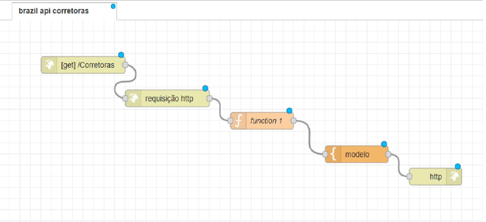

# Broker-Catalog
O projeto consiste de uma API que faz uma requsição a página: https://brasilapi.com.br/api/cvm/corretoras/v1

extrai os dados: 

nome_social  -  municipio  /  cnpj

e retorna:


# NODE-RED

uma poderosa ferramenta low-code

## Installation

primeiro é necessário instalar o nodejs através do site:

[Nodejs.org](https://nodejs.org/en)

Após a instalação é possivel checar se está devidamente instalado através do prompt de comando:

```bash
node --version
```
Com o Nodejs devidamente instalado, ainda com o terminal aberto, para instalar o node red é necessário digitar o seguinte comando:

```bash
npm install -g --unsafe-perm node-red
```

## Utilização
### Inicialização do Node-Red
Para iniciar o Node-red digite no prompt de comando:

```bash
node-red
```
Depois abra o link: 

http://localhost:1880

ou digite no navegador:

http://127.0.0.1:1880/

### Importação do fluxo
 


## Código
O Fluxo é dividido em 5 nós:



### HTTP In
Endpoint responsavél por criar um serviço web simples.
    
Definido a URL: http://localhost:1880/Corretoras

###  HTTP request
Realiza a requisição HTTP no link: https://brasilapi.com.br/api/cvm/corretoras/v1


### FUNCTION
Processa o payload recebido do request returnando a mensagem já em formato de lista HTML

```Javascript
let corretoras = msg.payload;
corretoras = JSON.parse(corretoras);

// Extraindo apenas o nome social, municipio e o cnpj de cada corretora
let listaFormatada = corretoras.map(item => {
   return `${item.nome_social}  -  ${item.municipio}  /  ${item.cnpj}`;
});

// Formatando a mensagem como lista 
let htmlLista = "<ul>";
listaFormatada.forEach(item =>{
   htmlLista += `<li>${item}</li>`;
});
htmlLista += "</ul>";

msg.payload = htmlLista;
return msg;
```

### TEMPLATE
Responsavél por gerar a página html com o returno do API

```html
<html>
  <head>
    <title>Catalogo de corretoras</title>
    <style>
      body {font-family:Arial, sans-serif; padding:20px; background-color:#f2f2f2;}
      h1 {color: #007acc;}
      ul { list-style-type:none; padding:0;}
      li {margin: 5px 50px; padding: 5px; background-color:white; border-radius:4px;}
    </style>
  </head>
  <body>
    <h1>Lista de corretoras</h1>
    <p>{{{payload}}}</p> {{!-- 3 chaves para renderizar HTML vindo do payload --}}
  </body>
</html>
```

### HTTP RESPONSE
Responsavél por enviar uma resposta de volta ao cliente que fez uma requisição HTTP para o fluxo.